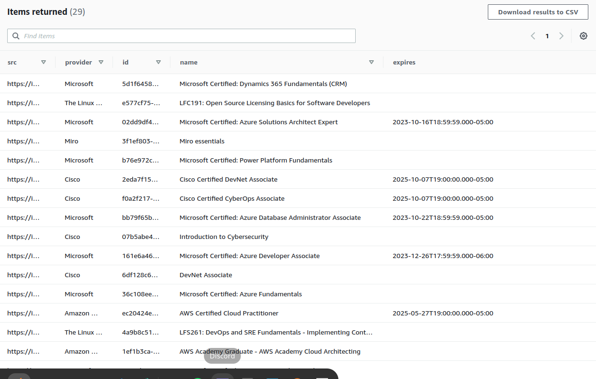

# Crawler Service

## Current Implementation

1. Read Badges Data from Credly to DynamoDB

## Sample Data



## Columns

### Badge

```json
{
  "id": "<badge id>",
  "name": "<badge title>",
  "src": "<image link>",
  "provider": "<provider name>",
  "expires": "<expires date time>"
}
```

## Required Environment Variables

```bash
export AWS_ACCESS_KEY_ID=
export AWS_SECRET_ACCESS_KEY=
export AWS_REGION=
export DYNAMODB_TABLE_NAME=
export CREDLY_USERNAME=
```

## TODO

- [ ] Multiple Data Store Options (Extendable)
- [ ] Custom Mapper Columns
- [ ] Multiple Providers

## License

MIT